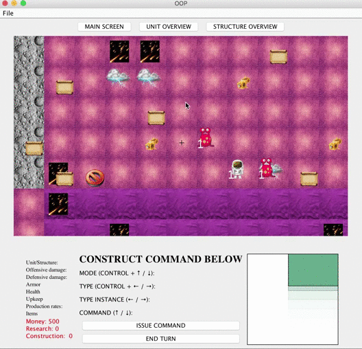
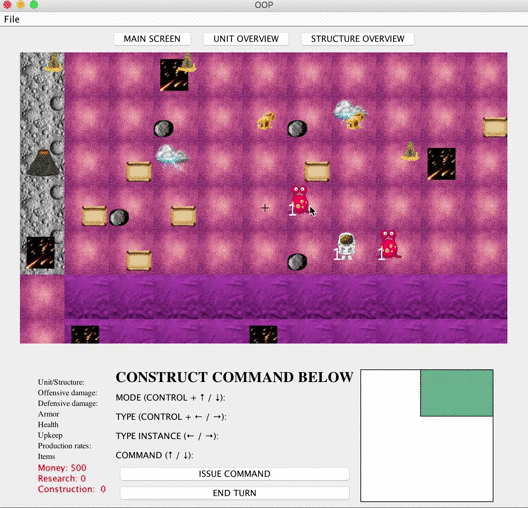
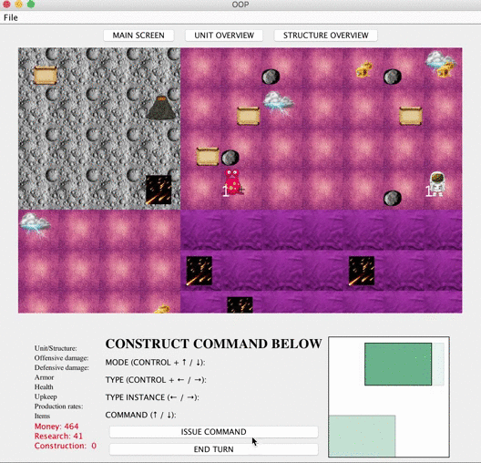
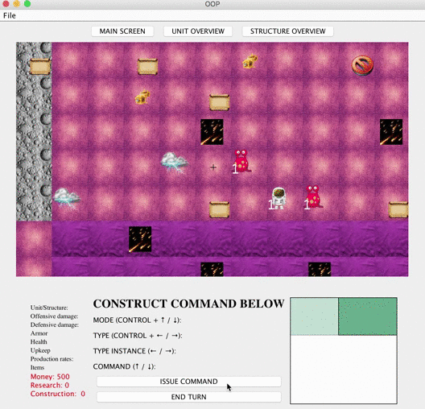

# Sprint1
First Sprint Iteration of OOP Turn-Based Strategy Game

[Iteration 1 requirements](Iteration1_Requirements.pdf)

## Each player starts with 2 explorers and a colonist

 

## Unit movement

 

## Units interacting with terrain

  
  
## Colonist creatiog Base

  

#Design
https://drive.google.com/drive/folders/0B1tlQl7ckmbka1Z2LXkyRGVVaVE
